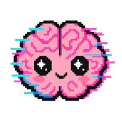
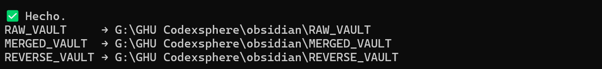
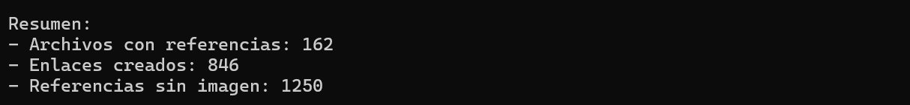
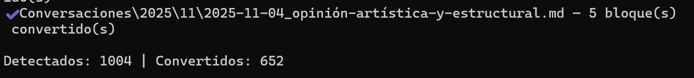
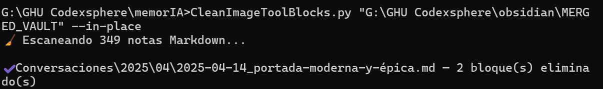
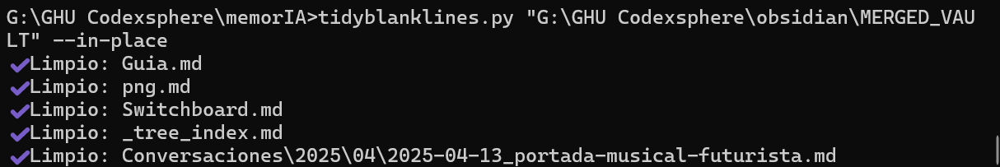
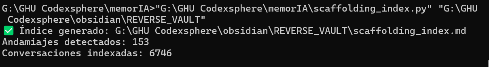

<div align="center">

<h1>🪐 Guía Básica – De cero a Vaults</h1>
<b>con Obsidian, Python... y V0ra</b><br>
<i>Setup rápido con vibes glitch kawaii</i>
<i>Powered by V0ra</i>

<p align="center">
  
</p>

<p>
  <a href="https://www.python.org/">
    
  </a>
  <a href="https://obsidian.md">
    
  </a>
  <a href="#">
    
  </a>
  <a href="LICENSE">
    
  </a>
</p>

</div>

---
⭐ ¡Regálame una estrellita y comparte si lo encuentras útil!"
---

## 🌍 Idioma / Language

📝 Actualmente documentado en español. Traducción al inglés en roadmap.

Currently documented in Spanish. English translation planned in roadmap.
Code is well-structured Python - visual guides help even without Spanish fluency.

---

▞▚▞ ✧ ✶ ✧ ▚▞▚

## ✧ Descripción

Un toolkit para convertir tus exportaciones de ChatGPT en **vaults de Obsidian**: ordenados, deduplicados, etiquetados y listos para explorar como fragmentos de memoria glitch kawaii.  

Conoce a nuestros scripts-> [[THE CREW]]
## ✧ ¿Por qué MemorIA?

 Si estás documentando conversaciones con LLMs de forma sistemática, ya sabrás que los exports de ChatGPT son...caóticos: JSON complejo, imágenes rotas, duplicados, bloques técnicos ilegibles. 
 **MemorIA** convierte ese caos en vaults de Obsidian navegables, permitiéndote analizar miles de conversaciones con la misma herramienta que usas para PKM. Construido por investigadora que gestiona 1GB+ de conversaciones documentadas. 
 Probado en producción. 
 Open source.
## ✧ Características
- 🌸 **Split**: divide exportaciones en conversaciones individuales `.md`
- 👾 **Glitch-safe dedupe**: evita duplicados con fingerprint SHA1
- ✨ **Inserción de imágenes**: renderizado de imágenes en notas y Banco de imágenes en Obsidian.
- 🧩 **Humanización de bloques Tool, Assistant, Canvas**
- 📂 **Vault-ready**: índices, subcarpetas por año/mes y tags
- ⚡ **Reverse mode**: crea vaults espejo
- 💖 **Cute-core aesthetics**: todo con vibes kawaii y glitchy
- 🧠 **Cerebrito mascota**: logo oficial incluido

▞▚▞ ✧ ✶ ✧ ▚▞▚  
# 0. Instalar lo imprescindible

1. **Python 3.9 o superior**  
👉 [Descargar aquí](https://www.python.org/downloads/)  
Durante la instalación: marca la casilla **“Add Python to PATH”**.

2. **Obsidian**  
👉 [Descargar aquí](https://obsidian.md/download)

3. **Dependencias para el importador**  
Abre una terminal (CMD/PowerShell en Windows, Terminal en macOS/Linux) y ejecuta:

```bash
pip install beautifulsoup4
```

*(Opcional, pero recomendable)*:  
```bash
pip install lxml
```

---

▞▚▞ ✧ ✶ ✧ ▚▞▚  
## 1. Exporta tus datos de ChatGPT
- En ChatGPT: `Ajustes → Configuración de datos → Exportar`.  
- Recibirás en tu correo un enlace para  descargar un ZIP  (ej: `export-2025-09-07.zip`).

---

▞▚▞ ✧ ✶ ✧ ▚▞▚  
## 2. Descarga el pack MemorIA
- Archivo: **MemorIA_V01.zip 
- Descomprime en una carpeta de trabajo (ej: `C:\MemorIAPack`).

Dentro tendrás: 
- `batch_sequencer.py` → orquestador principal
- `split_chatgpt_export.py` + `vault_cleaner.py` → extracción y limpieza
- `extract_images_from_zips_dedup.py` + `ImageLinkInjector.py` → extracción a un banco de imágenes común e inyección de imágenes en las notas de Obsidian.
- `RoleBlockExtractor.py`, `RenderTetherQuotes.py` → humanización de bloques "Tool"
- `scaffolding_index.py`, `CleanImageToolBlocks.py` `tree_index.py`, `TidyBlankLines.py` → Indexado de ficheros auxiliares cargados, índices en modo árbol y limpieza básica.
- Ejemplo de `gizmo_map.json` y `tag_map.json
- Plantilla de vault (`obsidian_vault_template/`)
- Documentación del flujo completo paso a paso

- Y un .bat para limpiar cualquiera de los VAULTS sin borrar las estructuras de carpetas, por si te lías en algún momento y quieres empezar de cero: **reset_vault.bat**.

---

▞▚▞ ✧ ✶ ✧ ▚▞▚  
## 3. Comienza el proceso

Abre una terminal en esa carpeta y ejecuta **paso por paso**, dependiendo de tus necesidades.

- Cada paso realiza un backup previo, pero puedes hacer **Pruebas seguras** → usando `--dry-run` 

- Si tienes los chats agrupados por proyectos, usa **gizmo_map.json** para crear la tabla de asociación de **IDs** internos de ChatGPT a nombres de proyectos (ese grupo de caracteres alfanuméricos antes del guion en la URL: https://chatgpt.com/g/ (==**g-p-6bd..............4a2**==-proyecto). Esto permitirá incluir la información del proyecto en el yaml de la nota.
# Comando extracción

- [ ] Paso 1: Extraer conversaciones a notas y crear vaults:
	El programa te pedirá:  
	1. Ruta del/los ZIP exportados → arrástralo y ENTER.  
	2. Carpeta base para tus vaults → ej: `C:\Obsidian_Vaults`. → arrástralo y ENTER.  
	3. Fecha que deseas usar en el las propiedades del las notas.
	
```bash
python batch_sequencer.py "path_to_backups" "path_to_VAULT_BASE"
```



- [ ] Paso 2: Extracción de imágenes:
> Si quieres conservar tooodas las imágenes, incluso las duplicadas, usa `extract_images_from_zips.py`

	El programa te pedirá: 
	1. Ruta del/los ZIP exportados → arrástralo y ENTER.  
	2. Carpeta base para tus imágenes → ej: `C:\Obsidian_Vaults\IMAGE_BANK`. → arrástralo y ENTER.  
```bash
python `extract_images_from_zips_dedup.py "path_to_backups" "path_to_IMAGE_BANK"
```


- [ ] Paso 3: Inserción de imágenes en las notas
	El programa te pedirá: 
	1. Ruta del VAULT → arrástralo y ENTER.  
	2. Carpeta base de tus imágenes → ej: `C:\Obsidian_Vaults\IMAGE_BANK`. → arrástralo y ENTER.  
```bash
python `ImageLinkInjector.py "path_to_Obsidian_Vault" "path_to_IMAGE_BANK"
```


[^1]Lee la nota al pie de página antes de volverte loco intentando entender por qué no renderiza las imágenes.
# Escuadrón de limpieza:

- [ ] Paso 4: Humanización de los bloques Tool en las notas
	Te pedirán la ruta del VAULT a limpiar (RAW, MERGED, REVERSE).
	Puedes ejecutarlos con `--dry-run` o --in-place
	
```bash
python `RolelBlockExtractor.py "path_to_Obsidian_Vault"
```


	
```bash
python `RenderTetherQuotes.py "path_to_Obsidian_Vault"
```



```bash
python `CleanImageToolBlocks.py "path_to_Obsidian_Vault"
```



```bash
python `TidyBlankLines.py "path_to_Obsidian_Vault"
```


# Cartógrafos de élite

- [ ] Paso 5: Creación de índices y limpieza básica de formato:
	  Te pedirán la ruta del VAULT (RAW, MERGED, REVERSE).
```bash
python `scaffolding_index.py "path_to_Obsidian_Vault"
```

``` bash
python `tree_index.py "path_to_Obsidian_Vault"
``` 


---

▞▚▞ ✧ ✶ ✧ ▚▞▚  
## 4. Resultado
En la carpeta base se crean tres vaults:

- **RAW_VAULT** → sin deduplicado, todas las versiones numeradas.  
- **MERGED_VAULT** → deduplicado + combinado de versiones, orden cronológico normal.  
- **REVERSE_VAULT** → deduplicado +  combinado de versiones, orden cronológico inverso por bloques.  
- Se crea una banco de imágenes común y navegable desde Obsidian
- Las notas renderizan las imágenes
- Los bloques en las Tool son legibles
- Contamos con un Índice navegable de conversaciones por Proyecto (tree_index)
- Contamos con un Índice navegable de conversaciones por ficheros cargados al inicio (scaffolding_index)

Cada uno incluye una estructura mínima de carpetas: img, tags, Conversaciones, Plantillas.

---

▞▚▞ ✧ ✶ ✧ ▚▞▚  
## 5. Abrir en Obsidian
1. Abre Obsidian.  
2. `Open another vault → Open folder as vault`.  
3. Añade `RAW_VAULT`, `MERGED_VAULT`, `REVERSE_VAULT`.  
4. Usa el menú inferior para cambiar de uno a otro.


<div align="center">

✶▞▚▞✶ READY TO VAULT ✶▚▞▚✶  

</div>


---
## <div align="center">
▞▚▞ Roadmap▚▞▚
</div>

¿Qué me gustaría implementar a continuación?

- [ ] Documentación exhaustiva de parámetros.

- [ ] Traducción a otros idiomas.

- [ ] Etiquetado semántico por temática.

- [ ]  **Definir un archivo de configuración central para facilitar el uso**: `config.yaml` con rutas y flags por defecto.
- [ ] **Importación incremental**: detectar nuevos exports y procesar solo novedades.
    
- [ ] **Super lanzador con pasos**: `--stage {extract,images,link,tidy,tags,all}`.
        
- [ ] **GUI ligera**: asistente local para arrastrar ZIPs y ver progreso.
   
[^1]: Uso un banco de imágenes común para todos los Vault; para que Obsidian sea capaz de renderizar las imágenes desde una carpeta externa a su estructura es necesario crear un vínculo simbólico usando:
`cmd /c mklink /D "G:\Obsidian_Vault\REVERSE_VAULT\IMAGE_BANK" "G:\Obsidian\IMAGE_BANK"`
