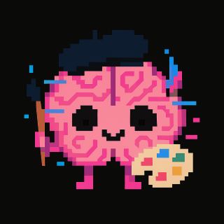
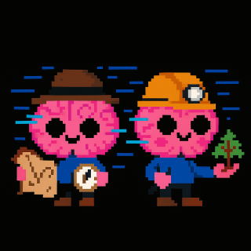

**Ecosistema completo para limpiar, humanizar y organizar exportaciones de ChatGPT en un VAULT de Obsidian** (incluyendo imágenes, herramientas internas y andamiajes)

# Comando extracción
### 🧩 1. `batch_sequencer.py`

| El director.                                     | Orquesta la extracción de notas y creación de vaults.                                                                                                                                                                                                                                                                                                                                                                                                                                                  |
| ------------------------------------------------ | --------------------------------------------------------------------------------------------------------------------------------------------------------------------------------------------------------------------------------------------------------------------------------------------------------------------------------------------------------------------------------------------------------------------------------------------------------------------------------------------------------- |
 | Secuencia todo el flujo: importa exports de ChatGPT (ZIP, JSON o HTML), genera un vault bruto (`RAW_VAULT`), luego uno limpio (`MERGED_VAULT`) y otro con bloques invertidos (`REVERSE_VAULT`).  - Usa `split_chatgpt_export.py` para dividir exportaciones.      - Llama a `vault_cleaner.py` para fusionar y limpiar.      - Admite un `gizmo_map.json` para asociar IDs internos de ChatGPT a nombres de proyectos.      - Crea plantillas de estructura base para los vaults. |
👉 Es el **punto de entrada maestro** para convertir dumps de ChatGPT en vaults de Obsidian legibles.

### 2. `split_chatgpt_export.py`

| **El detective del sistema.**  | Busca hilos y los convierte en notas.                                                                                                                                                                                                                                                                                                                                                                                                                                                                                                                                              |
| ------------------------------ | ---------------------------------------------------------------------------------------------------------------------------------------------------------------------------------------------------------------------------------------------------------------------------------------------------------------------------------------------------------------------------------------------------------------------------------------------------------------------------------------------------------------------------------------------------------------------------------- |
 | Convierte cada export (ZIP, JSON, HTML) en notas Markdown estructuradas con front-matter YAML.  - Extrae mensajes, autores, fechas, IDs de proyectos, y genera:          - `Project_name`, `source_project`, `source_project_id`              - `tags:` automáticos (si usas un `tag_map`)          - Crea carpetas por año/mes y genera índices (`_index.md`, `_tags/`)      - Soporta versionado, deduplicación, naming limpio, y control por CLI.      - Interpreta bien los formatos de export de ChatGPT con su estructura JSON compleja. |
 👉 **Convierte los datos crudos en notas Obsidian completas.**

### 🧹 3. `vault_cleaner.py`

| **Depura y fusiona.**            | Cocina los ingredientes para crear notas legibles y ordenadas.                                                                                                                                                                                                                                                                                                     |
| -------------------------------- | ------------------------------------------------------------------------------------------------------------------------------------------------------------------------------------------------------------------------------------------------------------------------------------------------------------------------------------------------------------------ |
 | Recoge las notas creadas por el anterior y:  - Agrupa versiones de la misma conversación.      - Elige la más larga o fusiona los mensajes sin duplicar.      - Puede invertir el orden de los bloques (### User / ### Assistant).      - Mantiene front-matter y metadatos.      - Crea un vault limpio, sin ruido ni repeticiones. |
👉 Deja un vault depurado y homogéneo listo para análisis o lectura.

### 🗜️ 4. `extract_images_from_zips_dedup.py`

| **Extractor de imágenes.**              | Extrae las imágenes del ZIP y las deja en un banco común.                                                                                                                   |
| --------------------------------------- | --------------------------------------------------------------------------------------------------------------------------------------------------------------------------- |
 | Busca y saca todas las imágenes de los ZIPs de exportación (las de ChatGPT o herramientas), deduplicando por hash SHA-256.   Crea un **banco común de imágenes únicas**. |
👉 Alimenta al `ImageLinkInjector.py`.

### 🖼️ 5. `ImageLinkInjector.py`

| **Repinta las imágenes.**         | Pinta las imágenes en las notas.                                                                                                                                          |
| --------------------------------- | ------------------------------------------------------------------------------------------------------------------------------------------------------------------------- |
 | Reemplaza referencias internas tipo `sediment://file_<id>` dentro de las notas por wikilinks Obsidian (``), buscando en el banco de imágenes. |
👉 Vuelve a conectar las imágenes originales a sus notas.

---
# Escuadrón de limpieza:

Nuestro escuadrón de limpieza te ayudará a dejar las tus notas de Obsidian legibles para humanos, limpias y ordenadas.

 | - Humanizadores 	- de bloques de herramientas 	- de bloques de carga de archivos - Limpieza de metadatos del bloque de imágenes - Limpieza de líneas vacías dobles, etc. |
| ------------------------------------------ | ------------------------------------------------------------------------------------------------------------------------------------------------------------------------------------ |
### 🔧 1. `RoleBlockExtractor.py`

**Humaniza bloques de cualquier tipo (`### User`, `### Assistant` o** `### Tool`)...  
Convierte bloques técnicos con JSON (tool calls, audio, canvas, transcripciones, tether_quote, etc.) en texto legible tipo:

`### Assistant Tool-Block: nombre_del_archivo "Texto procesado..."`

Opcionalmente conserva el JSON original plegado dentro de `
`.

👉 Traduce trazas de herramientas internas en narrativa comprensible.

### 🧩 2. `RenderTetherQuotes.py`

**Convierte los “tether_quote”.**  
Detecta los bloques tipo:

`### Tool {'content_type': 'tether_quote', 'domain': 'Archivo.md', 'text': '...'}`

y los transforma en:

`### Assistant 📄 Archivo cargado: **Archivo.md** > contenido...`

👉 Vuelve legibles las citas y anclajes de documentos cargados.

### 🧹 `3. CleanImageToolBlocks.py`

Elimina los bloques técnicos de imágenes después de insertar los enlaces visibles.

Detecta fragmentos como:

`### Tool {'content_type': 'image_asset_pointer', 'asset_pointer': 'sediment://file_00000...', ...}`

o

`### User {'content_type': 'image_asset_pointer', 'asset_pointer': '', ...}`

y los deja así:

``

👉 **Limpia los metadatos sobrantes** de imágenes ya insertadas,  
dejando solo el enlace Obsidian visible y eliminando los diccionarios `{...}` asociados.
### ✂️ 4. `TidyBlankLines.py`

**Limpieza estética.**  
Reduce saltos de línea múltiples a uno solo en todos los `.md`.  
Pequeño pero esencial para dejar todo legible.

---
# Cartógrafos de élite

 | Crearán dos índices navegables para que tengas una visión  por contexto y por proyecto de tu VAULT. |
| ------------------------------------ | --------------------------------------------------------------------------------------------------- |

### 🧱 1. `scaffolding_index.py`

**Genera el índice de andamiajes.**  
Escanea todas las notas y crea `scaffolding_index.md` listando los archivos mencionados en “📄 Archivo cargado: **...**”.

👉 Índice navegable de los documentos que sirvieron como contexto en las conversaciones.

### 🪞 2. `tree_index.py`

**Crea un índice tipo árbol.**  
Organiza las notas por `Project_name → Año → Mes`, con wikilinks ordenados cronológicamente.

👉 Da una **visión estructurada por proyecto** dentro del vault limpio.

### 🔄 Flujo completo resumido

1. **batch_sequencer_robusto.py** → coordina todo.
    
2. **split_chatgpt_export.py** → exporta cada conversación a Markdown.
    
3. **vault_cleaner.py** → fusiona y depura.
    
4. **extract_images_from_zips_dedup.py** → extrae imágenes únicas.
    
5. **ImageLinkInjector.py** → reinserta las imágenes en los textos.
    
6. **ToolBlockExtractor.py** → humaniza bloques de herramientas.
    
7. **RenderTetherQuotes.py** → convierte los andamiajes (`tether_quote`).

8. CleanImageToolBlocks.py→ limpia bloques de metadatos de imágenes.

9. **TidyBlankLines.py** → limpieza final de formato.
    
10. **scaffolding_index.py** → crea índice de archivos de contexto.
    
11. **tree_index.py** → genera índice jerárquico por proyecto.
        

---

En conjunto, este sistema convierte un export caótico de ChatGPT en un **vault Obsidian limpio, con imágenes restauradas, textos legibles, índices, tags y estructura por proyectos**.  

> Dicho sin rodeos: un pipeline de archivística digital digno de un museo del pensamiento conversacional.